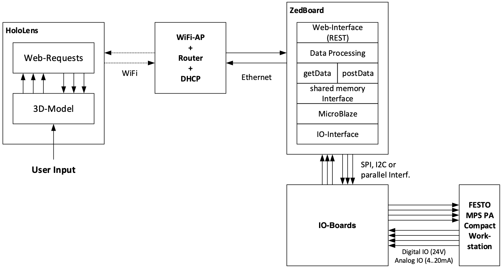
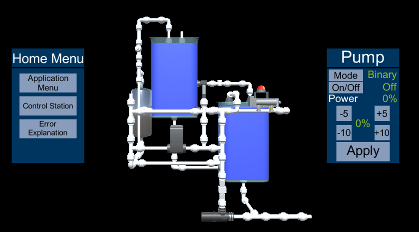
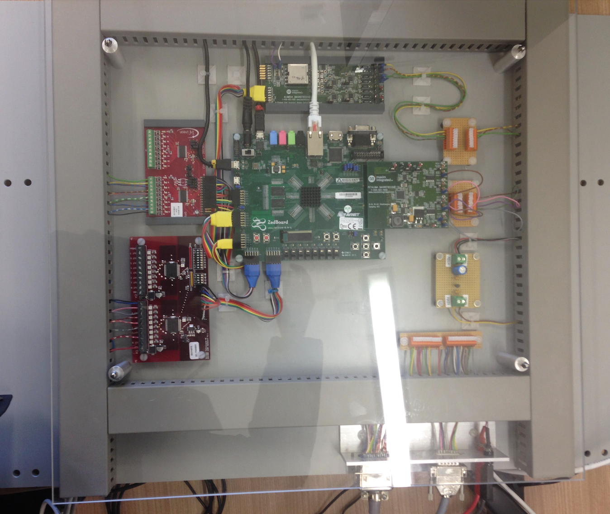
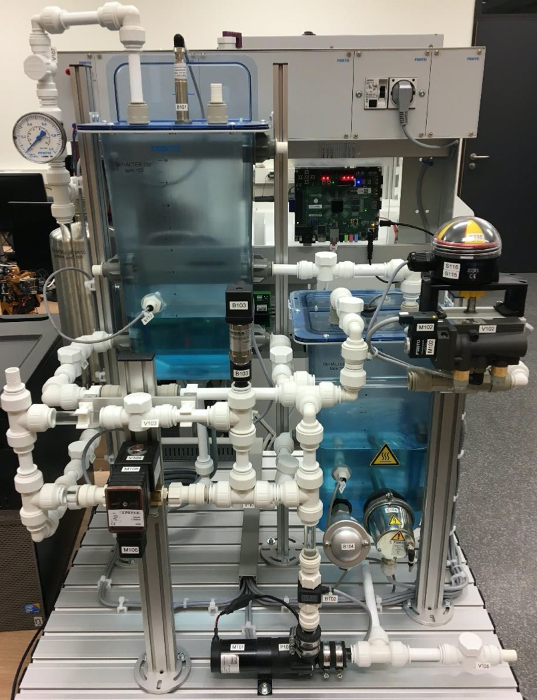

# Virtual Festo Twin

## Overview

This project realizes the remote control of an industrial plant, the [Festo Workstation](https://www.festo-didactic.com/de-de/lernsysteme/prozessautomation,regelungstechnik/compact-workstation/mps-pa-compact-workstation-mit-fuellstands-,durchfluss-,druck-und-temperaturregelstrecken.htm?fbid=ZGUuZGUuNTQ0LjEzLjE4Ljg4Mi40Mzc2), by using the [Microsoft HoloLens](https://www.microsoft.com/hololens). Sensor values can be read out and actuators controlled via an interactive 3D model of the Festo workstation, which is projected into the user’s field of vision and thus enables a visual presentation of the current state of the Festo workstation. Furthermore, the user can also be provided with assistance for maintaining and controlling the Festo workstation by an automatic error detection and visual assistance in the 3D model.

Developed by Caner Kazanci, Jan Knittel, Paul Knopp and Max Menne at the chair of [Embedded Systems for Information Technology, Ruhr-University Bochum](https://www.esit.ruhr-uni-bochum.de/) in coorperation with [Avnet Silica](https://www.avnet.com/wps/portal/silica/) and [Microsoft](https://www.microsoft.com/).

#### Exhibitions
This project was exhibited and presented at the [embedded world](https://www.embedded-world.de) 2018 as well as the [CDNLive 2018](https://www.cadence.com/en_US/home/cdnlive/emea-2018/proceedings.html), among several other events. A short review of this project by Frank Schirrmeister (Cadence) can be found [here](https://semiengineering.com/embedded-world-2018-security-safety-and-digital-twins/).

#### Structure of the repository
The code of the project contained in this repository is organized in the following folders:
1. [`Hardware_Design`](Hardware_Design) contains the hardware design and configuration of the ZedBoard created with Vivado,
2. [`Hololens`](Hololens) contains the augemented reality application including the 3D model of the Festo Workstation,
3. [`Microblaze`](Microblaze) contains the implementation of the communication protocols between MicroBlaze and I/O boards,
4. [`Zedboard`](Zedboard) contains the implementations for the data processing and the web interface.

## Features
- Web interface to the sensors and actuators of the Festo Workstation
- Interactive 3D model of the Festo Workstation presenting the values of:
  - a pressure sensor
  - an ultrasonic level sensor
  - a temperature sensor
  - a flow rate sensor
- as well as controlling:
  - a pump
  - a pneumatic valve
  - a control valve
  - a heater
- Anomaly detection based on a control system
- Visual assistance within the 3D model to control the plant
- 2 different graphical web interfaces for controlling the Festo Workstation

## Setup
The project is composed of the following four elements:
- [Microsoft HoloLens (1st Generation)](https://docs.microsoft.com/de-de/hololens/hololens1-hardware)
- Router
- [ZedBoard](http://zedboard.org/product/zedboard)
- I/O boards:
  - Digital input/output: [Infineon AN-EVAL 2x8-ISO1|811T](https://www.infineon.com/dgdl/Infineon-EVAL_Board_ISO1I811T-AN-v01_02-EN.pdf?fileId=db3a3043324cae8c01324d3006070019) and [2x8-ISO1H815G-1](https://www.infineon.com/dgdl/Infineon-Evaluation_board_coreless_transformer_isolated_high_side_switch_with_ISO1H815G-AN-v01_00-EN.pdf?fileId=db3a304326dfb13001271ed693904e89)
  - Analog input/output: [maxim integrated Petaluma](https://www.maximintegrated.com/en/design/reference-design-center/system-board/5827.html) and [Alameda](https://www.maximintegrated.com/en/design/reference-design-center/system-board/5839.html)
- [Festo MPS PA Compact Workstation](https://www.festo-didactic.com/de-de/lernsysteme/prozessautomation,regelungstechnik/compact-workstation/mps-pa-compact-workstation-mit-fuellstands-,durchfluss-,druck-und-temperaturregelstrecken.htm?fbid=ZGUuZGUuNTQ0LjEzLjE4Ljg4Mi40Mzc2)

The following diagram provides a rough overview of the entire structure of the system and the connection between the different components:

<table>
  <tr>
     <td>3D model</td>
     <td>Zedboard and I/O boards</td>
     <td>Festo Workstation</td>
  </tr>
  <tr>
    <td></td>
    <td></td>
    <td></td>
  </tr>
 </table>

## Development
The following software was used to create this project:
- AR application:
  - Unity (Version 2017.1.1f1)
  - Blender (Version 2.79)
  - Microsoft Visual Studio Code (Version 1.19)
- Zedboard:
  - Vivado (Version 2017.1.0415.1)
  - Vmware Workstation (Version 14.0.0)
  - PetaLinux (Version 2015.2.1)
